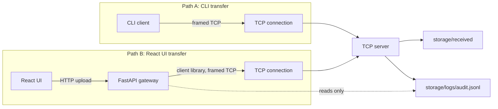
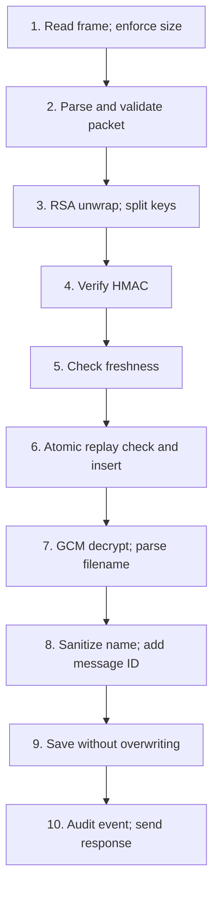

# CryptaLink

CryptaLink is an educational secure file-transfer mini-project. A Python client encrypts a file and sends it to a local TCP server using a framed binary protocol. A FastAPI gateway can forward browser uploads through the same client and server path for a demonstration UI.

## Architecture



The CLI path encrypts before sending over TCP. In the UI demo path, the browser sends the file to the local gateway over plain HTTP before encryption; only the gateway-to-server hop is protected. The gateway uses the same client library and the same TCP server pipeline as the CLI.

## Security mechanisms and parameters

| Mechanism | Parameters | Purpose |
| --- | --- | --- |
| RSA-OAEP | RSA-3072, SHA-256 for OAEP and MGF1 | Wrap the per-transfer session secret |
| Session secret | 64 random bytes; first 32 bytes AES key, last 32 bytes HMAC key | Independent encryption and packet-integrity keys |
| AES-GCM | AES-256, fresh random 12-byte nonce, 16-byte tag | File confidentiality and authenticated encryption |
| HMAC | HMAC-SHA256, constant-time `compare_digest` | Covers the complete packet except its own 32-byte tag |
| Message ID | 16 random UUID4 bytes | Replay detection |
| Timestamp | uint64 Unix seconds; absolute difference at most 60 seconds | Freshness check |
| Replay cache | In-memory, entries live 120 seconds | Reject duplicate message IDs |
| File / packet limit | 10 MiB file; packet limit includes a 255-byte UTF-8 filename and protocol overhead | Bound memory and frame sizes |
| TCP | `127.0.0.1:9000`, one request per connection | Local framed transport |
| Gateway | `127.0.0.1:8000` | Local browser demo API |

### Why hybrid encryption?

RSA is slow and OAEP can only encrypt a small amount of data. CryptaLink uses AES-GCM for the file and RSA only to transport the short-lived session secret.

GCM provides encryption and an authentication tag. HMAC is retained as a separate integrity layer for the syllabus and because it also covers packet header fields and the RSA-wrapped session secret. The HMAC key is inside that wrapped secret, so the server must RSA-unwrap before it can verify HMAC. HMAC does not prevent replay: a captured packet still has a valid HMAC, so freshness and the message-ID cache are also required.

Each transfer uses a fresh session secret and a fresh nonce. This makes nonce reuse across transfers negligible. Message IDs are inserted into the replay cache only after HMAC and freshness pass, preventing unauthenticated packets from poisoning it. A valid-HMAC packet with a bad GCM tag consumes its ID because insertion happens before decryption.

The replay cache is in memory, so a server restart clears it. The timestamp check still rejects captured packets after the 60-second freshness window.

## Packet format

Each TCP frame has a four-byte unsigned big-endian length followed by that many packet bytes. TCP is a byte stream and does not preserve application message boundaries, so the receiver uses `recv_exact` and rejects an oversized length before reading the body.

| Request field | Size | Notes |
| --- | ---: | --- |
| Magic | 4 bytes | ASCII `CLNK` |
| Version | 1 byte | `0x01` |
| Message ID | 16 bytes | UUID4 bytes |
| Timestamp | 8 bytes | uint64 Unix seconds, big-endian |
| GCM nonce | 12 bytes | Fresh random nonce |
| Encrypted-key length | 2 bytes | 384 for RSA-3072 |
| Encrypted session secret | 384 bytes | RSA-OAEP-SHA256 |
| Ciphertext length | 8 bytes | Includes the GCM tag |
| Ciphertext | Variable | AES-GCM ciphertext followed by the 16-byte tag |
| HMAC | 32 bytes | HMAC-SHA256 over every preceding packet byte |

The AES-GCM plaintext is `filename_len (2-byte big-endian) + UTF-8 filename + file bytes`. The filename is encrypted with the file. GCM AAD is `magic + version + message_id + timestamp`.

The response frame body is `status (1 byte) + message_id (16 bytes) + reason_len (2 bytes) + UTF-8 reason`.

| Code | Status | Meaning |
| ---: | --- | --- |
| 0 | `OK` | Stored successfully |
| 1 | `MALFORMED` | Invalid magic, version, or field lengths |
| 2 | `INTEGRITY_FAILED` | RSA unwrap or HMAC failed |
| 3 | `STALE_TIMESTAMP` | Timestamp is outside the 60-second window |
| 4 | `REPLAY` | Message ID was already processed |
| 5 | `DECRYPT_FAILED` | GCM tag or decrypted plaintext parsing failed |
| 6 | `TOO_LARGE` | Frame or decrypted file exceeds a limit |
| 7 | `INTERNAL` | Unexpected server-side failure |

These distinct results support the demo. A production protocol would generally avoid exposing detailed verification failures.

## Verification order

The server processes each transfer in this order:

1. Read one length-prefixed frame and enforce the packet-size limit.
2. Parse and validate packet magic, version, lengths, and boundaries. A `MalformedPacket` maps to status 1.
3. RSA-OAEP unwrap the session secret and split the AES and HMAC keys. Unwrap failures map to status 2.
4. Verify HMAC with `hmac.compare_digest`. Failure maps to status 2.
5. Check `abs(now - timestamp) <= 60`. Failure maps to status 3.
6. Atomically check and insert the message ID. A duplicate maps to status 4.
7. Decrypt with AES-GCM and parse the filename. Invalid UTF-8 or an invalid filename-length prefix in successfully decrypted plaintext maps to status 5.
8. Sanitize the filename and prefix it with the message ID.
9. Save the file without overwriting an existing file.
10. Write the audit event and return the response.



No file is saved after a rejection. Every handled pipeline result, including malformed and internal failures, writes an audit event. A writable audit file is required for logging. The TCP server is the only process that writes `audit.jsonl`; the gateway reads events and verifies the chain without creating or appending to the log.

## Gateway step mapping

The gateway reports client-side steps from actual packet construction and transmission. It infers server-side steps only from the returned status; later checks are shown as skipped.

| Server status | `verify_hmac` | `freshness` | `replay_check` | `decrypt` | `store` |
| --- | --- | --- | --- | --- | --- |
| 1 `MALFORMED` | Not passed | Not passed | Not passed | Not passed | Not passed |
| 2 `INTEGRITY_FAILED` | Failed | Skipped | Skipped | Skipped | Skipped |
| 3 `STALE_TIMESTAMP` | Passed | Failed | Skipped | Skipped | Skipped |
| 4 `REPLAY` | Passed | Passed | Failed | Skipped | Skipped |
| 5 `DECRYPT_FAILED` | Passed | Passed | Passed | Failed | Skipped |
| 6 `TOO_LARGE` | Not passed | Not passed | Not passed | Not passed | Not passed |
| 7 `INTERNAL` | Not claimed | Not claimed | Not claimed | Not claimed | Not claimed |

For statuses 1 and 6, no server-side step is marked passed. Status 7 also makes no inferred pass claims because the failure stage is not identified by that code.

## Keys and trust

Generate the server key pair with `python scripts/gen_keys.py`, or let the TCP server generate it on first start. The files are `keys/server_private.pem` and `keys/server_public.pem`; `keys/` is gitignored. Set optional `KEY_PASSPHRASE` in a local `.env` to encrypt the private PEM. The server prints a SHA-256 fingerprint of the public key's DER SubjectPublicKeyInfo; the gateway reports the same fingerprint at `/api/status`.

This is trust-on-first-use (TOFU): verify the displayed fingerprint through an independent channel before trusting the public key. Windows does not enforce POSIX mode `600`; protect the private key with Windows filesystem ACLs.

## Windows setup and run

Use Python 3.11 or later. From the repository root:

```powershell
python -m venv .venv
.\.venv\Scripts\Activate.ps1
python -m pip install -r requirements.txt
Copy-Item .env.example .env  # optional; set KEY_PASSPHRASE if desired
python scripts/gen_keys.py
```

Run the TCP server and gateway in **separate terminals**. Both processes stay running while you use the CLI or UI. In the server terminal:

```powershell
python -m server.server
```

The server prints its fingerprint. Press Ctrl+C to stop it; it prints `Server stopped` and exits without a traceback.

In another terminal, start the gateway. On Windows, use `python -m uvicorn`:

```powershell
python -m uvicorn gateway.main:app --host 127.0.0.1 --port 8000
```

The gateway is at `http://127.0.0.1:8000/api`; interactive API docs are at `http://127.0.0.1:8000/docs`. The CLI can run from a third terminal:

```powershell
python -m client.client send .\sample.txt
```

Replace `sample.txt` with an existing file smaller than 10 MiB; key generation and server startup do not create a sample upload.

For a clean UI install, open a third terminal and run:

```powershell
Set-Location frontend
npm.cmd install
Copy-Item .env.example .env
npm.cmd run dev
```

This starts the UI in mock mode by default. To connect it to the backend, set `VITE_USE_MOCK=false` in `frontend/.env` while the gateway is running. The [frontend/README.md](frontend/README.md) documents mock mode, real-gateway mode, and production build commands.

The gateway permits browser origins `http://localhost:5173` and `http://127.0.0.1:5173`. Its OpenAPI document is available at `http://127.0.0.1:8000/openapi.json`.

## Tests and demos

Run the backend suite from the repository root:

```powershell
python -m pytest tests -q
```

The verified result for this build is **51 passed, 0 failed, 0 skipped**. Tests cover key wrapping, AES-GCM, HMAC, packet validation, replay and audit behavior, the verification pipeline, real TCP framing/transfers, attack cases, gateway responses, CORS, and the OpenAPI contract.

Run the full terminal demo with a file under 10 MiB:

```powershell
scripts\demo.bat .\sample.txt
```

It starts the TCP server if needed, sends a normal file, tampers with ciphertext, immediately replays the original packet, sends a stale packet, then verifies the audit chain. **Run the replay within 60 seconds of the normal send**; otherwise the timestamp check rejects it as stale before replay detection. The demo's observed output was:

```text
normal: status=0 message_id=78d77e1b9c4f48b8b47abec30edc09b0 reason=accepted
tamper: status=2 message_id=78d77e1b9c4f48b8b47abec30edc09b0 reason=HMAC verification failed
replay: status=4 message_id=78d77e1b9c4f48b8b47abec30edc09b0 reason=message ID already processed
stale: status=3 message_id=dfaf54f9459d423d9397af570489db3f reason=timestamp outside the 60-second window
Audit log chain: valid
```

Verify the current log separately with:

```powershell
python scripts/verify_log.py
```

The log is `storage/logs/audit.jsonl`. It is a SHA-256 hash chain of canonical JSON records with sequence numbers, timestamps, event type, result, reason, source IP, size, previous hash, and record hash. Editing or deleting a record breaks verification. An attacker who can rewrite the whole file can rebuild the chain, so it is tamper-evident rather than tamper-proof.

Recorded event types include `SERVER_START`, `TRANSFER_ACCEPTED`, `INTEGRITY_VIOLATION`, `REPLAY_REJECTED`, `STALE_TIMESTAMP`, `MALFORMED_PACKET`, `DECRYPT_FAILED`, `OVERSIZE_REJECTED`, and `INTERNAL_ERROR`.

## Screenshots

Place project screenshots in `docs/screenshots/`. Add image links here as screenshots become available.

## Threat model summary

| Threat | Mitigation | Remaining risk |
| --- | --- | --- |
| Network eavesdropping on TCP | AES-256-GCM encryption | Size and timing remain visible |
| Packet modification | HMAC-SHA256 and GCM authentication | Detailed demo statuses can reveal which check failed |
| Replay | 60-second freshness window and 120-second in-memory ID cache | Cache is lost on restart; the timestamp window still limits old packets |
| Cache poisoning | Insert IDs only after HMAC and freshness pass | High request volume can consume CPU and memory |
| Path traversal | Basename handling, safe-character filtering, message-ID prefix | Prototype filesystem assumptions |
| Oversized frames | Length check before body read and 10 MiB file cap | No rate limiting or connection throttling |
| Audit edits | Hash chain detects local edits and deletions | Full-file rewrite can rebuild the chain |
| Server public-key substitution | Fingerprint check with TOFU | User must verify the fingerprint independently |

## Limitations

- No sender authentication: anyone with the server's public key can create a valid transfer.
- The replay cache is in memory and is cleared when the server restarts.
- Browser-to-gateway traffic is plain HTTP; only the gateway-to-server hop is protected.
- Public-key trust uses TOFU; there is no certificate authority or automatic key rotation.
- RSA-decrypting unauthenticated input costs server CPU before HMAC can be checked.
- There is no rate limiting or connection throttling.
- The complete file is held in memory and limited to 10 MiB.
- The audit chain detects edits but cannot stop an attacker who can rewrite the entire log.
- This is an educational prototype, not a production file-transfer service.

## Future work

Possible next steps include sender signatures or client certificates, TLS for browser-to-gateway traffic, persistent replay state, key rotation, and rate limiting. These are outside the one-day educational scope.
